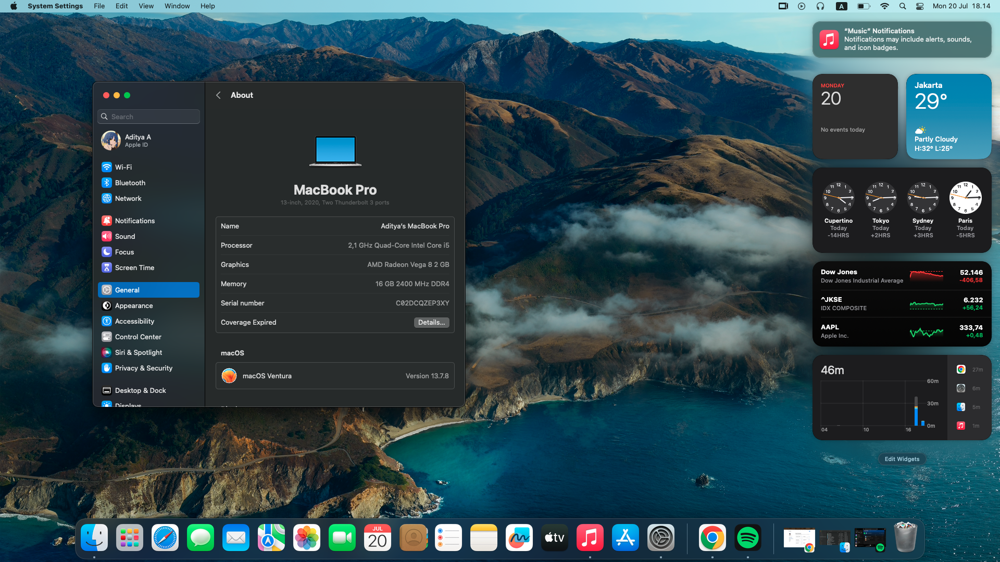

# ThinkPad X395 Hackintosh (macOS Ventura)

-blue.svg)

OpenCore EFI configuration for **Lenovo ThinkPad X395** running macOS Ventura 13.7.8. Optimized for the AMD Ryzen mobile platform with native power management and graphics acceleration.

> 💡 **Note:** I just made this EFI for fun, so feel free to enjoy it as-is and develop it further yourself. Honestly, it's a total skill issue on my end to fix the remaining bugs—and by the way, this `README.md` was written by AI because I'm just too lazy, lmao :v

---

## 💻 Device Information

| Specifications | Details |
| :--- | :--- |
| **Computer Model** | Lenovo ThinkPad X395 |
| **CPU** | AMD Ryzen 5 3500U @ 2.10GHz |
| **Memory** | 16 GB DDR4 (Soldered) |
| **NVMe SSD** | NVMe SSD |
| **Integrated Graphics** | AMD Radeon Vega 8 Graphics |
| **Wireless Card** | Intel Wireless Card |
| **Input Devices** | ThinkPad Keyboard, Trackpad, TrackPoint (Red Dot Pointer) |
| **I/O Ports** | USB Ports (Mapped via `USBMap.kext`), USB-C, HDMI |

---

## 📊 Hardware Component Status

| Feature / Component | Status | Notes |
| :--- | :---: | :--- |
| **CPU Power Management** | Working ✅ | Runs perfectly with stable performance |
| **Graphics (iGPU)** | Working ✅ | AMD Radeon Vega 8 fully accelerated via `NootedRed.kext` |
| **Display & Brightness** | Working ✅ | Built-in display working with smooth scaling |
| **USB Ports** | Working ✅ | Fully mapped and patched via `USBMap.kext` |
| **Keyboard** | Working ✅ | Media keys and shortcuts function correctly |
| **Trackpad & TrackPoint** | Working ✅ | Smooth tracking, gestures, and the red pointer work flawlessly |
| **NVMe Storage** | Working ✅ | Functioning normally with native APFS support |
| **Wi-Fi** | Working ✅ | Functioning normally using Intel OpenIntelWireless drivers |
| **Bluetooth** | Issue ⚠️ | Bug Kext Maybe? |
| **Touchscreen** | Issue ⚠️ | Bug Kext Maybe? |
| **Continuity Camera** | Issue ⚠️ | Bug Kext Maybe? |

---

## 🛠️ Usage

If you have the exact same laptop model and hardware configuration as mine, you can use this configuration by replacing your current **EFI** folder with the one provided in this repository.

---

## 📷 Screenshots

---
